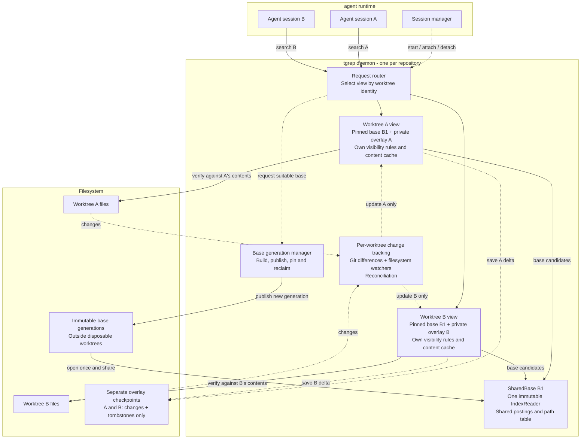
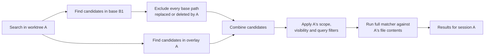
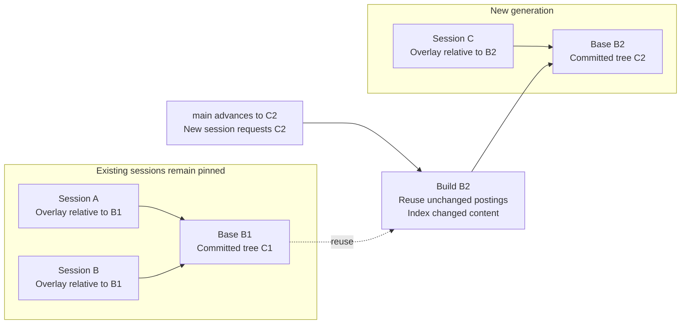

# Shared worktree index design

**Status:** shared readers, committed-tree generations, private reconciliation
and the opt-in repository daemon are implemented. The default shared **v1**
contract remains retain-all and fixed-pin. Explicit **managed v2** additionally
provides atomic advancement, owner guards, reference-aware collection, allocations
and storage-only maintenance. See the [managed contract](#managed-client-contract)
below; the earlier sections describe the architecture and legacy v1 behavior.
Ordinary single-root CLI/server behavior remains the default.

## Goal and ownership

An agent runtime may create many worktrees from the same repository. Rebuilding
a complete trigram index for every session duplicates indexing work, disk
storage, and memory. Instead, tgrep should share immutable base data and index
only the differences belonging to each worktree.

The boundary is: **tgrep owns search correctness; the agent runtime owns
session lifecycle.** The main checkout is another worktree with its own
overlay, not a mutable source of truth for every session.

| Responsibility | Owner |
| --- | --- |
| Shared readers, base generations, overlay precedence, persistence | tgrep |
| Git-difference discovery, watchers, reconciliation, safe scan fallback | tgrep |
| Worktree-specific filtering, filename membership, and content caches | tgrep |
| Starting/supervising the daemon and configuring resource budgets | Agent runtime |
| Attaching/releasing worktrees as sessions start/stop | Agent runtime |
| Supplying the intended starting revision and known-change hints | Agent runtime, validated by tgrep |

Runtime notifications are an optimization, not the source of truth. External
editors, Git commands, and build tools can change files independently.

## Overall architecture

Run one repository-scoped daemon, identified by the canonical Git common
directory, rather than by a remote URL or branch name. Linked worktrees share
this identity; unrelated clones do not accidentally share mutable state.



The daemon shares the actual `Arc<IndexReader>`, including its loaded path
table, not just the names of the memory-mapped files. Worktrees retain
independent roots, overlays, visibility/membership state, watcher queues,
and synchronization so a checkout in one worktree need not block another's
searches.

## Base snapshots and worktree overlays

A base describes an exact committed tree under a compatible indexing profile.
Its implemented key includes repository identity, Git tree OID, indexing profile,
and index-format version; retain the commit OID for diagnostics. The profile
must account for content decoding, checkout transformations, and corpus
coverage. Dirty and untracked files from the main checkout belong in its
overlay, never in the shared base.

Every worktree pins an exact base generation. Its overlay contains the
differences between that base and the worktree's current searchable contents,
not merely differences from its current `HEAD`.

| Difference | Overlay representation |
| --- | --- |
| Added or modified file | Postings for the complete current file |
| Deleted or newly ineligible base file | Tombstone hiding its base entry |
| Renamed file | Old-path tombstone and new-path entry |
| Eligible untracked file | Worktree-only entry |
| File restored exactly to the base | Remove the override and expose the base |

Use Git diffs to discover paths, not to index patch hunks. Whole-file indexing
preserves matching across edit boundaries, context lines, and line numbers.
Discovery must include committed branch divergence, staged changes, unstaged
changes, and eligible untracked files. A commit inside a session does not make
its differences from the pinned base disappear.

## Search flow



This illustrates the existing `HybridIndex` precedence model: overlay entries
shadow base paths even when their new content does not match the query.
Candidate IDs and path resolution must use the same pinned reader snapshot,
with overlay mutations synchronized for that operation.

The base supplies candidates, not another checkout's contents. Final matching
reads the requesting worktree or its correctly versioned cache. Cache entries
must not be keyed only by relative path across worktrees. Sharing cached bytes
by content identity is a later optimization requiring verified identity.

For example, editing `auth.rs` in A hides that path's base postings only in A.
Deleting `old.rs` in A hides it with a tombstone. B still sees its own versions.
The same membership/visibility rules must apply to content searches and
`--files`, including filename-only paths without searchable postings.

## Registration, readiness, and freshness

The versioned daemon API implements these operations; the concrete wire contract
is below:

| Operation | Purpose |
| --- | --- |
| `attach(root, revision, profile, lease)` | Select/pin a base, capture changes and return a view identity, lease and readiness |
| `search(root, view, query)` / `files(root, view, query)` | Route requests to the private ready view |
| `refresh(root, view, lease, changed, full)` | Invalidate immediately; return the processed epoch after reconciliation |
| `detach(root, view, lease)` | Release one lease; retire the view only after the final lease |

Normal CLI invocations should discover the same view automatically. Releasing
one session must not stop a daemon or worktree view still used by other clients.
Canonicalize and validate roots and request paths; a worktree identity is not
permission to read arbitrary paths. Protocol capability negotiation must
distinguish this service from the existing single-root server.

On attach, start capturing changes before establishing the initial delta.
Reconcile Git/filesystem state, replay queued events, and publish a consistent
base-plus-overlay view. If coverage is incomplete or change discovery fails,
scan rather than presenting a partial index as complete. A known changed path
can be verified by direct scanning while its replacement postings are built.

Keep periodic reconciliation and watcher-overflow recovery. Merely draining a
watcher queue does not prove that no filesystem notifications were missed.
An acknowledged refresh can establish that specified edits have been processed;
it is not a filesystem-wide snapshot guarantee. `--no-index` remains the escape
hatch for reading current disk contents under normal traversal rules.

Sharing removes repeated full-content indexing, not necessarily all
repository-sized startup work. Git status, untracked-file discovery, and
watcher registration may still inspect many paths. Measure these costs
separately before introducing filesystem-monitor or registration optimizations.

## When the base changes

**Never update a shared base in place.** Build and publish a new immutable
generation when a requested starting revision needs one. Deduplicate concurrent
build requests for the same compatible base.

| Event | Action |
| --- | --- |
| First session at a revision | Build a compatible base if none exists |
| Another session at the same tree/profile | Reuse the base and establish its overlay |
| Agent edits files or commits on its branch | Update only that worktree's overlay |
| New session starts from an updated `main` | Build or reuse a base for the new revision |
| `main` advances without a new session | No required work; background prewarming is optional |



Building B2 should reuse compatible unchanged postings and extract only changed
content. It can still require streaming/writing a new full index generation;
avoiding extraction does not eliminate publication I/O.

Initially, do not migrate active sessions automatically. A checkout or rebase
can be represented by recomputing that worktree's overlay against its pinned
base. An explicit base migration must instead recompute the delta against the
new base and atomically publish the new base-and-overlay pair. Swapping only
the reader would give the overlay the wrong meaning.

Retain old generations until no active worktree, in-flight query, or retained
restorable checkpoint needs them. A retention policy may evict idle checkpoints
and release their pins; restoration must then rebuild/reconcile, not silently
substitute another base. Defer removal of mapped generations on Windows.

The current core manager deliberately implements **retain-all**, not online GC:
it never deletes or rewrites a published generation, even when its last
`Arc<Generation>` pin is dropped. This also protects escaped readers/views and
restorable checkpoints across process restarts. There is no deletion API or
automatic active-session migration. Reclaiming storage offline requires stopping
all users and discarding dependent checkpoints. A later daemon can introduce
ownership-aware retention and resource budgets; absence of a live in-process pin
alone is not proof that a generation is deletable.

## Persistence and compatibility

Store bases outside disposable worktree directories. Persist each worktree's
delta separately, bound to its exact base and identity. Checkpointing a session
must not materialize another complete index or merge its changes into the base.

| Concern | Required behavior |
| --- | --- |
| Ignore rules and corpus coverage | Use worktree-specific membership. A shared tracked-path superset can avoid irreversible omissions; newly admitted files absent from the base still need discovery/indexing |
| Hidden files and `--files` | Maintain worktree visibility and filename-only membership, not just content postings |
| CRLF, encoding, LFS, smudge filters | Git blobs are not necessarily checkout bytes; reuse postings only with compatible content semantics, otherwise index affected files or scan |
| Sparse checkout, symlinks, submodules, case behavior | Respect materialized paths and existing traversal semantics, not just the committed tree |
| Incompatible query options or partial coverage | Fall back to the existing scan behavior rather than omit eligible files |
| Missing daemon/checkpoint/base | Use a validated reconciled view or scan; never silently answer from the base alone |
| Restart or interrupted publication | Validate the generation/checkpoint pairing and re-establish freshness before enabling indexed queries |

The current checkpoint implementation guarantees atomic replacement visibility,
including overwriting an existing checkpoint on Windows. It syncs file contents
before replacement but does not sync the parent directory afterwards; this is
**not a power-loss durability guarantee**. Stale or missing checkpoints must be
reconciled or rebuilt.

Existing CLI behavior, RPC protocol, index format, and single-root serving must
remain available while shared mode is introduced explicitly. Do not implement
sharing by pointing today's servers at the same `--index-path`: their
publication path still writes a complete index.

## Implemented generation API

`tgrep_core::generations::Repository::discover(root)` invokes Git without a shell
and identifies the canonical native common directory. `.git` files, linked
worktrees, subdirectories and bare repositories are supported. Independent
clones do not share identity, even with equal tree OIDs and remotes.
`Repository::git_dir()` retains the discovered worktree's metadata directory so
symbolic revisions such as `HEAD` resolve there, not at another worktree's HEAD.
Ambient `GIT_*` environment overrides and replace refs are ignored; Git failures,
missing objects and unsupported native/index paths are explicit errors.

`GenerationManager::new(repository)` uses
`<common-dir>/tgrep-bases-v1/<repository-identity>/`.
`with_storage(repository, storage)` accepts an existing trusted external
directory and uses a repository-identity subdirectory. It rejects storage in
registered worktrees, Git metadata or another index snapshot. Stores and their
ancestors must not be externally renamed or modified while in use.
Checks cover the effective canonical repository-identity directory as well as
the supplied parent, including an existing worktree or snapshot at that child.

| API | Contract |
| --- | --- |
| `Repository::resolve_commit_tree(revision)` | Resolve exact commit/tree IDs without building or publishing; symbolic revisions use the discovered worktree |
| `ensure(revision, profile, predecessor)` | Resolve an exact commit/tree, build or reuse the key; incompatible supplied predecessors error |
| `EnsureResult` | Pinned `Arc<Generation>`, requested commit, and per-request `BuildStats` |
| `open(key)` / `list()` | Open exact or list validated published generations; errors never become empty bases |
| `Generation::key()` / `commit_oid()` | Serializable exact repository/tree/profile/format/schema key; first publishing commit for diagnostics |
| `Generation::base()` | The shared `Arc<SharedBase>`; use existing worktree/overlay APIs without changing their validation |
| `entries()` / `entry(path)` | Sorted complete tracked membership, Git modes/OIDs/raw sizes and content classification |
| `TrackedEntry::matches_worktree_bytes(bytes)` | Decoded-content identity comparison only, not a freshness/visibility/eligibility claim |
| `retention()` | `RetentionPolicy::RetainAll`, including after all current pins drop |

The versioned profile is `RawGitBlobAutoV1` plus `TrackedRegularFilesV1` and a raw
blob-size cap (64 MiB by default; `None` disables it). It invokes the existing
automatic decoder, binary classifier and masked trigram extractor on raw blobs,
never checkout-filtered bytes. Ignore rules, hidden visibility and binary
extensions are deliberately not applied to this tracked-path superset.
Destination mode/size eligibility is always recomputed. Only regular-file
predecessor entries with compatible indexed content supply reusable postings.
Binary entries may reuse their classification, but cannot supply absent postings.
Empty and short text entries carry a content identity even with zero postings.
Oversized, binary, symlink and gitlink records remain distinguishable in tracked
membership; symlinks and gitlinks are not followed or content-indexed.

Clean Git status and equal blob IDs do not prove equivalence of worktree bytes.
The synchronization layer verifies decoded identities from checkout reads, or
overlays transformed/changed files. It also applies worktree-specific membership,
including ignored/extension-filtered files, sparse checkout and filesystem case
behavior. Non-UTF-8 tracked names, unsafe relative paths, and paths unrepresentable
on the current platform are explicit unsupported errors, not lossy aliases.
Native repository paths are retained losslessly. Content/coverage enum versions
must advance if their semantics change, independently of the index format.

A supplied compatible predecessor provides postings by blob identity, including
renames/copies, without reading unchanged blob contents. Changed/new blobs use
one `git cat-file --batch` process and the existing spill sorter, then publish a
complete streamed index. Memory includes one blob, its decoded text/masks,
O(tracked paths) metadata and the bounded sorter arena, not all postings.
Without a predecessor the first build extracts the full committed corpus.
`BuildStats` counts actual blob reads/bytes, extraction calls, reused indexed
files, copied postings, and whether this request published or reused a generation.
`predecessor_posting_lists_read` counts decoded predecessor lists; when no indexed
paths reuse postings, generation creation does not traverse the predecessor.
Empty/short indexed files retain their paths and content identities without
triggering that traversal. Strict snapshot opening records per-file posting
presence during its existing validation pass, including for older generations;
there is no new metadata field, format boundary, or additional posting scan.
Publication I/O and metadata enumeration are not eliminated by extraction reuse.

One OS file lock per repository store serializes cooperating processes, including
different-tree builds; it is released on process exit/crash. A weak in-process
cache shares live `Arc<Generation>` pins and their shared reader/path table.
Cold validation/fingerprinting runs outside the process-wide cache mutex, so it
does not block unrelated repository cache hits; insertion rechecks for a winner.
Staging uses unique `.stage-*` directories on the same filesystem. The complete
index is strictly opened, its fingerprint and checksummed tracked metadata
validated, and files synced before atomic directory rename to the key's name.
Final directories are never overwritten, even if corrupt. Abandoned staging
directories are ignored, not advertised or automatically garbage-collected.
Atomic visibility is not a parent-directory power-loss durability guarantee.
These checks detect inconsistent/corrupt data; storage must still be trusted,
not treated as an authenticated format for adversarially rewritten files.

The synchronization layer retains the generation pin with each view and serializes
its key inside the delta checkpoint. The generation's `SharedBase` fingerprint still
binds the checkpoint to exact index bytes. Reopening that key is not readiness:
reconcile the worktree before enabling indexed queries.

## Implemented worktree synchronization API

`tgrep_core::worktrees::WorktreeView::new(root, pin, options)` validates that the
canonical root is an actual worktree root in the pinned repository. Independent
clones, bare repositories and subdirectory roots are rejected. The exact
`Arc<Generation>`, canonical root and worktree Git directory stay with the view;
no mutable base/flush handle is exposed and no base migration occurs.

| API | Contract |
| --- | --- |
| `WorktreeOptions` | Existing `MetaWalkOptions`, bounded `hint_capacity`, optional existing private `checkpoint_directory` |
| `invalidate_path(relative)` | Close query gate; queue a file/subtree hint, including old/new rename paths; invalid input errors and forces full repair |
| `invalidate_all()` | Close gate and require full verification for startup, overflow, Git/config changes, missed events or polling uncertainty |
| `refresh()` | Rewalk membership/visibility; verify hints/new/stat-changed files or, without hints, all admitted contents |
| `reconcile_full()` | Always read/verify content, irrespective of size/mtime/Git-status equality |
| `status()` | Ready flag, invalidation epoch, published epoch, pending-path count and full-required flag |
| `with_snapshot(closure)` | Guarded query-only view with root/epoch/visibility, resolved paths and read-only candidate opens; verifies pinned-root identity before/after the callback |
| `save_checkpoint()` | Ready-only, delta-only atomic `overlay.json`, including exact generation key/root/base binding |
| `restore(root, pin, options)` | Explicit errors for missing/invalid/mismatched checkpoints; successful restore remains not ready |
| `ReconcileStats` | Actual content reads/bytes/decodes/extractions, base/overlay reuse, copied base files/postings, reads avoided and `hint_lookups` ordered-set probes |

The agent runtime subscribes **after construction and before initial refresh**,
then forwards native/polling/no-watch inputs through these same invalidations.
Each refresh makes one bounded attempt, serialized per view. Files are prepared
outside the readiness lock; invalidations can continue to arrive. Overlay,
visibility and filename membership publish together only if the captured epoch
still matches. Otherwise `ChangedDuringReconcile` leaves the view not ready with
full work pending. Retrying replays by full verification; sustained churn must
scan or wait, never spin indefinitely. Incomplete metadata walks (including
ignore-rule errors), unreadable tracked exemptions, failed reads and detected
read instability also keep the gate closed. No base-only success is possible.
Native directory/file names are validated before converting metadata-walk paths
or recording visibility. Non-Unicode names and literal Unix backslashes produce
discovery errors instead of aliasing valid or ignored paths; ordinary native-path
full scans remain the fallback.
Reconciliation holds a stable root directory handle. The extracted
`tgrep_core::rooted::RootedDir` helper (`open`, relative `open_file`, `verify_root`)
is also retained once per ordinary server and reused across indexing, watcher
and verification passes, rather than reconstructed for each file open. Unix descends with component-relative
`openat`, `O_NOFOLLOW` and `O_NONBLOCK`, then verifies the final handle is regular.
Windows holds ancestor handles without delete sharing, rejects reparse
points and validates the final handle's containment and actual parent before
reading. File version and identity are rechecked through rooted handles; a root identity change also
prevents publication. Errors leave readiness closed, including directory/link
swaps and regular-file/FIFO swaps. Windows keeps the root guard until view drop;
agent runtimes must release registrations before removing or renaming worktrees.
Ordinary serving retains its root guard for the server lifetime too: stop the
ordinary server before removing or renaming its served root on Windows.
Each reconciliation advances the epoch, including no-hint full repairs, so
successful publication acknowledges earlier invalidation tokens with an equal
or later epoch.

`WorktreeSnapshot::candidates(plan, prefix, include_hidden)` resolves both base
and live IDs before releasing the overlay guard. `files(prefix, include_hidden)`
comes from complete walker filename membership, not posting lists.
`open_file(relative)` returns a read-only regular-file handle from the view's
retained reader, never from a new registration of the root pathname.
`with_snapshot` checks pinned-root identity before and after every callback,
including empty/file-only queries; failure invalidates readiness and queues full
reconciliation. Candidate-open failures are latched and returned as an outer
I/O error, with readiness invalidated before releasing the guard even if the
callback swallowed the error or subsequently opened another file successfully.
A callback may return the owned handle for bounded matching
outside the guard; reenter `with_snapshot` and verify the original epoch before
publishing buffered results. File contents are not frozen by these handles.
Later handle-read errors remain caller-owned: report them and call
`invalidate_all()` after leaving the guard, without publishing partial results.
Hidden files
are included in canonical coverage and filtered at query time, including Windows
attributes and explicit hidden-directory scopes. Existing walker rules determine
ignore/extension, materialized symlink/submodule and regular-file behavior.
Missing, sparse and ineligible base paths are tombstoned; staged, unstaged,
committed-divergent and eligible untracked files use whole-file overlays. Restoring
the pinned content removes the override; committing divergent content does not.

Full passes walk without a metadata-only size cutoff, then bound actual reads to
the configured limit plus one byte and classify the bytes read. Eligible content
is auto-decoded and hashed before reuse, so CRLF, smudge, encoding, assume-unchanged
and skip-worktree cases cannot rely on clean status or index stat data. Verified
content-identical copies/renames can populate new overlay paths by copying base
masks in one streaming posting pass. Matching existing overlays keep their masks.

This saves trigram extraction, **not all repository-sized startup work**. Every
refresh walks metadata and membership. Full passes read/verify all admitted
content; hinted passes can retain previous evidence for unaffected paths under
the explicit event-driven freshness contract. Case-alias hints conservatively
reverify; non-ASCII hints and capacity overflow require full verification.
Accepted hints are rebuilt from normal path components, so trailing/repeated
separators and interior `.` spellings cannot lose subtree invalidations. Absolute,
parent-component and leading `.` component hints still error and require full repair.
Hint matching probes a `BTreeSet` for the normalized full path and ancestor
prefixes, rather than scanning every hint for every file. `hint_lookups` counts
these probes (at most path depth per file, each logarithmic in queue size);
the regression uses 2,001 pending hints but only five probes for two files.
Hinted passes still open eligible regular-file handles for safe metadata
verification even when content reads are avoided.
Same-size/restored-mtime edits without notifications are repaired by forced
full checks, not promised by hints. Successful refresh acknowledges processed
inputs, not an atomic filesystem snapshot. Final matching uses
`WorktreeSnapshot::open_file` or a private versioned cache, not an ordinary read
of `snapshot.root().join(path)` that could follow a raced link outside the
worktree. Contents can still change through later writes to the opened file.

Raw LF blobs and clean CRLF/smudge checkouts may differ for **every file**.
Normalizing line endings would invalidate positional/next-byte masks. Fixtures
assert three identical tracked files are read/decoded with zero extractions,
versus four clean transformed tracked files requiring four private extractions.
The linked worktree's plain `.git` pointer file adds one private extraction
in either case; later unchanged passes reuse all private overlays.
No transformed-content cross-view cache is
implemented. Preparation retains O(paths) metadata plus changed-file masks
until publication, in addition to the existing private overlay. A large
transformed checkout can therefore require substantial private memory.

Checkpoints use the foundation's single directory-bound atomic publication;
there are no unprotected auxiliary manifest writes. A configured private
checkpoint path must be an existing directory; construction, restoration and
saving reject regular-file paths instead of accepting an unusable view.
The checkpoint directory is excluded in its entirety (including staging files),
along with `.tgrep`, Git metadata directories, generation storage and caller-supplied
`walk.exclude_paths`. It cannot be an index snapshot, Git metadata or a worktree
ancestor. Storage must remain trusted and not externally renamed while in use.
The plain `.git` pointer in a linked worktree follows ordinary walker membership:
its filename and content are available with hidden inclusion, subject to ignore
and size rules. The named Git metadata directories remain excluded; the file's
contents are not followed as a filesystem link.
Restoration validates the exact generation key, base bytes and canonical root but
does not restore readiness or trusted read evidence; first reconciliation may
re-extract restored private postings. Missing/stale/invalid state is an explicit
recoverable error, not an empty overlay. Bases remain immutable and retain-all.

This core layer does **not** own native watchers, automatic shared CLI serving,
daemon routing/wire schemas or content caches. Existing CLI/server behavior is
unchanged unless a worktree is explicitly attached to the daemon described below.

## Daemon wire contract v1

Run `tgrep serve --shared ROOT --shared-storage EXISTING_EXTERNAL_DIRECTORY`.
The runtime supervises this foreground process. `shared attach ROOT --revision
REV --lease TOKEN`, `shared refresh ROOT --lease TOKEN [--changed REL ... | --full]`, and
`shared detach ROOT --lease TOKEN` are CLI wrappers emitting one JSON result.
The new literal subcommand name must be escaped as a pattern: `tgrep -- shared .`.

The common Git directory holds `tgrep-daemon-v1.json` (protocol, random-like unique
instance ID, repository identity, PID, loopback port, canonical storage path).
An OS lock in the same directory excludes a second daemon even with a different
storage choice. The listener/worker queues exist before registration publication.
Every attached worktree has a separate `tgrep-view-v1.json` in its **actual
worktree git_dir**, binding the daemon instance, canonical root, view ID and exact
generation. No `serve.json` schema is overloaded. Attach publishes this marker;
last detach removes it only if instance/view still match. Discovery stops at the
nearest Git boundary and validates capabilities, root/base/profile and readiness
before emitting any rows. Merely having a daemon is not attachment.
Client discovery carries one validated root/repository through daemon discovery
and lookup (three Git subprocesses total per attached CLI query). Daemon query
workers launch no Git subprocesses: they reuse the attached repository, rechecking
canonical root, nested boundaries, gitfile target and common-directory identity.
Real Git trace2 process-start events assert these counts in integration tests.

RPC is one newline-delimited JSON request/response per TCP connection, loopback
only. All requests have this envelope (including `hello`):

```json
{"jsonrpc":"2.0","protocol":1,"instance":"FROM_DAEMON_MARKER","repository":"FROM_DAEMON_MARKER","id":1,"method":"hello","params":{}}
```

Successful results repeat `protocol`, `instance` and `repository`. Errors have
`error.code` and `error.message`, never success-shaped empty results. V1 rejects
unknown envelope/parameter fields, malformed options and incompatible identities.
Clients require the matching request ID on successful responses. A valid error
object (integer code, string message, no result) may instead have an explicit
null ID when rejected before request parsing, preserving connection-queue
saturation diagnostics. Missing/mismatched IDs and malformed errors are rejected.
Search RPCs must omit `passthru` or set it to `false`; `true` is rejected with a
scan-required error because indexed candidates omit nonmatching files. The CLI
keeps `--passthru` on its existing filesystem-scan path when it emits all lines.
Canonical worktree roots must be UTF-8 for JSON transport. CLI and server reject
unsupported roots, including Unicode aliases to them, before serialization or
generation publication; the core API's native-path support is unchanged.
Gitfile and `commondir` targets retain native path bytes on Unix, even when
metadata lives outside a UTF-8 worktree. Discovery and identity revalidation
share the same decoder without spawning Git on the daemon's hot query path.
The existing `ignore` dependency is vendored at its locked version with the
same native-path correction in Git ignore-source discovery; ignore precedence,
nested repository boundaries and malformed-ignore failures are preserved.
See [dependency provenance and distribution](vendor/ignore/PATCHES.md).
Instance IDs prevent stale metadata/port reuse; they are not authentication
against hostile local processes. Storage, repository metadata and the loopback
user environment are trusted.

| Method | `params` | Result-specific fields |
| --- | --- | --- |
| `hello` | `{}` | `capabilities`, `profile`, `retention`, `limits` |
| `attach` | `root`, `revision`, `profile`, `lease` | `view`, `lease`, `root`, `generation`, `requested_commit`, `ready`, `attach_build` |
| `lookup` | `root` | Current view descriptor and status; does not create a lease |
| `status` | `root`, `view`, `query: {}` | Readiness, pending/full flags, epoch, last error/success, watcher mode, sharing/extraction counters |
| `refresh` | `root`, `view`, `lease`, `changed: []`, `full: false` | Descriptor plus `processed_epoch`; no hints means full verification |
| `detach` | `root`, `view`, `lease` | `remaining_leases`, `detached`, `view`, nullable `registration_warning` |
| `files` | `root`, `view`, `query: {scope, hidden, max_depth}` | Root-relative `files`, `epoch`, `ready`, `generation`, `backend: "shared-v1"` |
| `search` | `root`, `view`, `query` | Root-relative match/context rows, `file_stats`, `index_stats`, `epoch`, same view/base/backend fields |

The `recoverable-attach` capability requires a caller-owned `lease` on every
attach RPC: 1-128 ASCII letters, digits, hyphens or underscores. Persist a unique
token before sending. Repeating a live token with the same canonical root,
literal revision and profile replays the original attachment and `attach_build`
statistics, without allocating another lease or re-resolving symbolic revisions.
It works at the lease limit and after response loss. A token already used by
another root/revision is an error. Distinct callers use distinct tokens.
`lookup` followed by `detach` also releases a known token without its original
response; the CLI does that lookup automatically. Tokens are scoped to the
daemon instance, are not authentication credentials, and are forgotten on detach
or restart. After restart, explicitly attach again with fresh tokens.
Final detach always releases the view/lease even if registration cleanup fails;
it reports the failure in `registration_warning` and daemon stderr. Missing
markers are harmless. Corrupt or foreign markers are not removed without
matching instance/view identity, so their continued presence selects safe fallback.
CLI `--lease` is optional for interactive convenience: if omitted, a generated
token is printed on stderr before transmission and must be captured and supplied
on retry. Runtime integrations should always supply their own token.

The `profile` is required on attach:

```json
{"content":"raw-git-blob-auto-v1","coverage":"tracked-regular-files-v1","max_blob_bytes":67108864}
```

`query` uses the existing search RPC fields built by `server_search_request`:
pattern/extra_patterns, matcher flags, types/type_add/type_clear, globs,
context/output-detail fields, hidden, scope and max_depth. Only default automatic
decoding and the 64 MiB profile are compatible. `scope` is empty or an existing
relative directory, never a regular file; it cannot escape the root or cross a nested repository. Content reads
use no-follow root-contained handles, never another worktree's content cache.
Candidate collection captures an epoch; a concurrent invalidation rejects the
response before output. Read failures invalidate the view and return errors.

Views are shared only for the same root and exact tree/profile. Independent lease
tokens release independently, have no automatic expiry, and are invalid after
restart. Reattachment resolves and compares the requested tree with the existing
pin before any generation build/publication; a different commit with the same
tree is compatible when using a new lease. New generations may reuse a compatible currently pinned predecessor;
existing views never migrate. All generations/checkpoints are retained.
Generation and overlay directories are separate under external storage. A saved
delta is keyed by canonical root and exact generation and is full-revalidated on
reattach. Unavailable/corrupt generations or checkpoints cannot reveal the base.

Normal CLI search/files/status automatically use an existing attachment.
`--shared` additionally forces shared-only discovery. Explicit `--index-path`
preserves ordinary index intent unless combined with `--shared`. Stale/missing
forced registrations, incompatible options, saturation and not-ready states
produce meaningful scan diagnostics, bypassing all ordinary index shortcuts.
Marker entry presence includes dangling symlinks, so corrupt metadata cannot
silently select a stale ordinary index.
`status` reports an error rather than misleading legacy status. `--no-index`
always scans. Positive indexed globs filter the admitted corpus; scans can
reinclude ignored files, as with ordinary indexes.

Limits are aggregate and visible in `hello`: 32 views, 256 leases, 8192 native
subscriptions and 16384 hint slots by default. `--shared-max-views`,
`--shared-max-leases`, `--watch-budget`, `--watcher-queue-cap` select them.
Watch/hint budgets are fixed per-view shares of the configured maximum; there
is no borrowing. Bounded nonrecursive registration reuses the ordinary watcher
registry on each platform; too many directories or registration errors select
polling rather than partially claiming native coverage. There is one serialized
index/reconcile worker and two separate query workers, so repairing A does not
take a repository-global search lock or prevent ready B from searching. Work
queue capacity is max_views; query queue is 16, incoming connection queue 32.
Two routers enforce 1 MiB requests and timeouts. Responses over 64 MiB fail
explicitly without truncation. An encoded-byte budget checks borrowed rows before
allocating their JSON objects, counts filename/statistic/escaped-string overhead
across files, and bounds final serialization. Existing per-file matching state
and candidate/path tables remain proportional to the admitted input corpus;
the response cap is not a total-process memory cap. There is no content cache.
Mapped generations, path tables and private
postings still scale with repository/overlay size, not with a fixed memory cap.
Native directory registration and event filtering exclude the root's `.tgrep`
storage directory, not eligible hidden directories such as `src/.tgrep`.

Callbacks immediately invalidate the appropriate view; hints are bounded and
overflow/unknown events request full repair. Registration precedes initial
reconciliation. A failed or concurrently invalidated pass stays not ready and
retries; no base-only window exists. Consecutive failures use completion-based
exponential retry delays of 1, 2, 4, 8, 16 then 30 seconds; success or explicit
refresh resets the delay. Explicit refresh does not wait for the retry deadline.
Status exposes `reconcile_attempts`, `consecutive_failures`, `retry_delay_ms` and
the retained `last_error`. Daemon readiness stays closed until both the core
refresh and checkpoint publication finish, including failed checkpoint retries.
Candidate files are opened through the view's retained snapshot reader. Every
query ends with a root-verified epoch check, including empty and filename-only
responses; replacing the directory cannot pair old candidates with a new root.
Both auto and poll modes perform full
verification every `--poll-interval` seconds after completion (default 120), also
repairing missed bytes, ignores and external Git/global configuration changes.
Native notifications allow earlier incremental repair. `--no-watch` disables
both periodic and native refresh, not initial reconciliation or explicit runtime
refresh. Neither ready nor a processed epoch promises the newest possible bytes.

Integration tests measure three unchanged tracked files as 3 reads/decodes,
0 private extractions, and the same `Arc<SharedBase>` in both views. A linked
worktree's ordinary `.git` pointer file adds 1 read/decode and 1 private extraction
on initial reconciliation (4 reads and 1 extraction total); it remains visible
with `--hidden`, while real Git metadata directories stay excluded.
Four CRLF-transformed paths require 4 private extractions plus the linked
gitfile's 1 (5 total), with 0 new extractions on no-op verification.
Sharing never promises to eliminate startup reads or checkout transformations.

### Stateful parity and runtime lifecycle exercisers

The existing `shared_daemon` integration fixture also runs two bounded seeded
sequences (`stateful::`) and a process supervisor (`runtime::`). These are
test-only helpers, not an integration SDK or an automatic lease collector:

```sh
cargo test -p tgrep-cli --test shared_daemon -- stateful:: runtime::
cargo test -p tgrep-cli --test ripgrep_compat indexed_json_preserves_utf8_match_and_context_offsets
```

The parity sequences compose edits, additions, deletes, renames, staged and
unstaged versions, committed divergence, ignore changes, restoration to the
pin, reset/checkout/rebase, sparse materialization, CRLF checkout bytes and
daemon restart across three real worktrees. A small independent file/line model
checks isolation and membership, including hidden gitfiles, empty files and
filename-only binary entries. CLI line/count/match/file/JSON output is compared
with `--no-index`; scans exclude the main worktree's actual `.git` directory
because shared indexes intentionally exclude Git internals. Linked gitfiles
remain included. Unicode `-F -i` folds are checked through both base and overlay
paths, ignores and restarts. JSON comparisons retain offsets, lines, submatches
and match totals; only timing and backend work counters are normalized.
The accompanying regression checks multibyte UTF-8 before later match/context
rows through scans, local indexes and the ordinary server.

Every comparison requires the shared backend (RPC identity plus CLI stats/query
counters); a scan fallback cannot count as passing parity. Writes stop before
acknowledged hinted/full refresh barriers. Native-watch sequences additionally
require an event-driven publication before explicit refresh, with bounded retries
only for documented not-ready/concurrent-invalidation responses. This tests
processed-input contracts, not a promise that readiness proves latest disk bytes.

Defaults use seed `1742026`, one round per watch mode and small fixtures in normal
CI. Set `TGREP_SHARED_SEED` to a decimal u64 and `TGREP_SHARED_ROUNDS` to `1..16`
for replay/stress; invalid values fail rather than silently changing coverage.
Failures print the seed, round count and ordered operation log. Roles and edit
payloads vary by seed while prerequisite-dependent transitions remain ordered.
Each sequence has a 300-second-per-round overall deadline.

The supervisor persists caller-owned tokens outside worktrees before spawning
actual client processes. It combines simultaneous callers, repeated/lost-response
attach at the lease limit, explicit crash/timeout cancellation, journal-based
abandoned-lease recovery, daemon restart with fresh tokens, budget release and
detach-before-move/remove while a sibling keeps querying. Abandoned v1 leases remain
live until the runtime explicitly releases them; they have no expiry or GC.
File-backed child output avoids pipe deadlocks, RPC/start/stop waits are bounded,
and owned child guards kill/reap only their own PIDs on failure. The ignored
`runtime::runtime_client_process` test is a subprocess entry point invoked by the
supervisor, not an additional standalone test to run with `--ignored`.
Run watcher qualification on native filesystems (including native-ext4 WSL
checkouts rather than DrvFS); no platform is silently skipped.

## Implementation status and rollout

The implemented increments are additive; shared serving requires explicit opt-in:

| Surface | Current status |
| --- | --- |
| [`SharedBase`](tgrep-core/src/shared.rs) | Opens a validated reader once; creates independent worktree-rooted views sharing its `Arc` |
| [`HybridIndex`](tgrep-core/src/hybrid.rs) / [`LiveIndex`](tgrep-core/src/live.rs) | Reuses existing candidate merging, replacements, and tombstones |
| Overlay checkpoints | Atomic delta-only save/restore; validate format, root, paths, and exact base fingerprint |
| Base identity | Index fingerprint plus repository/tree/profile/format/schema generation key |
| Base immutability | Generation manager stages/validates/publishes once; external callers must not mutate mapped files |
| [`Regression coverage`](tgrep-core/tests/shared_worktrees.rs) | Sharing/isolation, masks, tombstones, restoration, compatibility, repeated saves, and Windows failure recovery |
| [`Generation management`](tgrep-core/src/generations/mod.rs) | Canonical common-dir identity, raw committed-tree builds, incremental posting reuse, cross-process deduplication, pins and retain-all |
| [`Generation coverage`](tgrep-core/tests/generations.rs) | Temporary repositories/worktrees, thread/process races, content transformations, immutable old readers, errors and interrupted publication |
| [`Worktree synchronization`](tgrep-core/src/worktrees.rs) | Pinned private views, actual-content verification, atomic readiness/membership, bounded invalidations, full repair and bound checkpoints |
| [`Synchronization coverage`](tgrep-core/src/worktrees/tests.rs) | Real divergent worktrees, scan/candidate parity, CRLF/smudge/decoding, sparse/assume-unchanged, filtering, epochs, errors and extraction counts |
| Shared CLI/daemon routing and native watchers | Versioned leases, discovery, bounded workers/watchers/hints, full repair, delta checkpoints, strict scan fallback |
| [Managed lifecycle](tgrep-core/src/managed/mod.rs) | Isolated guarded storage, transactional catalog, owner lifetimes, versioned migration, allocation admission, bounded collection and offline maintenance |
| [Managed CLI/RPC](tgrep-cli/src/serve/shared/managed.rs) | Negotiation, asynchronous operation receipts, owner holder, recovery, adaptive scheduling, live diagnostics and atomic idle shutdown |

Shared-base validation rejects mismatched empty lookup/posting sections and
metadata counts inconsistent with the opened sections, while allowing empty
indexes and short files. Shared snapshots require aligned, contiguous posting
ranges covering the entire postings section, valid trigrams, strictly
increasing valid file IDs in each posting list, and nonzero location masks.
Checkpoint destinations reject trailing separators and
current-directory suffixes, and exclude the base and its
descendants by directory identity, even if the base has been renamed. Unix
staging, replacement, and cleanup are relative to an open parent-directory
handle; Windows holds non-delete-sharing handles on the canonical parent and
all its ancestors until publication completes. A renamed/replaced pathname
cannot redirect publication into the base. Root identities preserve the existing
JSON string encoding for Unicode paths and use tagged platform-native units for
non-Unicode Unix/Windows paths; older readers reject the latter representation.

Both modes keep one shared base plus one private overlay per worktree, using
the same builder, matcher, rooted reads, reconciliation and query pipeline.
Managed lifecycle does not introduce a second search engine or a shared mutable
branch overlay.

## Managed storage and lifetime boundary

`serve --shared ROOT --shared-storage CACHE_PARENT --shared-policy POLICY_FILE`
opts into protocol/storage schema 2. `CACHE_PARENT` must already exist and be
trusted. The policy selects one immutable namespace storage kind:

| Kind | Reader/storage contract |
| --- | --- |
| `managed` | Guarded generation/checkpoint format; published objects can be collected under bounded policy |
| `compatibility-retain-all` | Adapter over legacy generation storage; v1 participants remain fixed-pin and legacy objects are never collected |
| No policy file | Original v1 daemon, layout, flags, leases and retain-all behavior |

The managed namespace is `CACHE_PARENT/tgrep-managed-v2/<repository-id>`.
Repository identity derives from the canonical native Git common-directory
identity, not a remote URL, branch name or disposable worktree. Two repositories
may use the same cache parent without sharing catalogs, accounting or authority.

```text
namespace.json        schema, namespace/repository and filesystem identities
owner.lock            exclusive namespace owner: daemon OR maintenance
activity.lock         admission/idle boundary, including independent readers
catalog.sqlite        transactional object/reference/operation/current-view catalog
guards/               per-incarnation and worktree-root lifetime guards
owners/               issued owner guard files and sealed instance challenges
objects/<physical-id> managed generation or checkpoint incarnation
```

Managed generation files use `paths.tgm`, `lookup.tgm`, `postings.tgm`,
`meta.tgm` and `generation.tgm`, incompatible magic and file-table format
`0x4d320001`. Old and unguarded readers reject them even under renamed legacy
filenames. No legacy-readable intermediate is published inside the managed
namespace. Existing v1 stores are not converted or retroactively made collectible.

Each publication has a fresh physical incarnation independent of its logical
repository/tree/profile key. A delayed deletion of an old incarnation cannot
delete a replacement for the same logical key. IDs are opaque 32-character
lowercase hexadecimal identifiers, not paths or authorization credentials.

`managed::open_generation` and the managed generation/checkpoint adapters acquire
OS-backed protection before opening data. Protection follows escaped
`Arc<Generation>`, `SharedBase`, `IndexReader`, derived worktree views, snapshots
and rooted candidate handles, including independent processes. It also covers
build predecessors, checkpoint restore and both sides of migration. Local
`Arc` counts alone are not reclamation evidence. Per-object guards allow an
unrelated obsolete object to be collected while ready views continue serving;
the namespace activity guard is used for idle shutdown, not to block all GC.

Namespace ownership is rooted in external storage and survives repository
deletion. Live startup also coordinates through the repository's common-directory
ownership lock, excluding simultaneous legacy and managed daemons. Catalog and
filesystem identities are checked together. Traversal/deletion is relative to
validated directory handles, with native Windows sharing/reparse checks and
Unix no-follow identity checks. Unknown files, symlinks, reparse points, hard
links, replaced members and foreign directories are preserved with diagnostics.
There is no broad directory sweep and no online deletion of another namespace.

## Managed policy

The policy file is a complete JSON object; fields have no silent unlimited
defaults, and unknown fields/unsupported schemas are errors. This illustrative
policy opts into managed storage but retains fixed-pin/retain-all behavior:

```json
{
  "schema": 2,
  "storage": "managed",
  "retention": {"mode": "retain-all"},
  "advancement": {"mode": "fixed"},
  "work": {
    "max_views": 32,
    "max_leases": 256,
    "workers": 2,
    "queue_items": 64,
    "staging_bytes": 536870912,
    "private_work_bytes": 134217728,
    "sort_buffer_bytes": 1048576,
    "blob_bytes": 8388608,
    "operation_timeout_ms": 120000,
    "page_objects": 128,
    "max_cursors": 16,
    "cursor_lifetime_ms": 30000,
    "max_receipts": 4096,
    "metadata_bytes": 67108864
  },
  "collection": {
    "schedule": {"mode": "periodic", "interval_ms": 60000},
    "on_pressure": true,
    "checkpoint_grace_ms": 300000,
    "generation_grace_ms": 3600000,
    "max_duration_ms": 200,
    "max_examined": 128,
    "max_removed": 16,
    "max_delete_bytes": 16777216,
    "chunk_bytes": 65536,
    "max_pages": 16,
    "retry_ms": 1000
  }
}
```

These are example allocations, not machine-independent recommended budgets.
Choose `blob_bytes` for the eligible corpus: a too-small input budget fails
attachment rather than silently omitting an eligible large file.

For bounded retention, replace `retention` with
`{"mode":"bounded","target_bytes":1073741824}`. Only managed storage accepts it.
For automatic advancement, replace `advancement` with:

```json
{
  "mode": "adaptive",
  "high_bytes": 67108864,
  "low_bytes": 16777216,
  "min_reduction_bytes": 8388608,
  "min_reduction_percent": 50,
  "cooldown_ms": 300000,
  "max_paths": 10000,
  "max_read_bytes": 134217728,
  "max_attempts": 3
}
```

`{"mode":"disabled"}` disables periodic collection; `on_pressure` separately
controls pressure-triggered collection. Retain-all still permits safe recovery
of abandoned staging/control state; it never authorizes reclaiming published
generations or checkpoints.

| Units/field | Accepted range or invariant |
| --- | --- |
| Bytes | Positive integers through signed 64-bit maximum unless stated otherwise; not percentages or free-space promises |
| Durations | Integer milliseconds, positive and representable by the monotonic clock; grace intervals may be zero |
| Views / leases | `1..1024` / `1..65536` |
| Workers / queue items | `1..64` / `1..65536` |
| Page objects / open cursors | Each `1..1024` |
| Receipt count / metadata | `1..1000000` / at least 1 MiB |
| Sort buffer | At least 16 KiB and representable by the platform address size |
| Private admission | Must cover each worker's four sort buffers, six blob buffers and 256 KiB, plus subsequently admitted work/retained state |
| Collection examined / removed / pages | Each `1..1000000`; all limits apply, not just successful removals |
| Deletion chunk | At least 4096 bytes, no greater than `max_delete_bytes` |
| Adaptive watermarks | `0 <= low_bytes < high_bytes` |
| Adaptive reduction / paths / attempts | `1..100` percent / `1..1000000` paths / `1..64` attempts |

Policy and allocation versions are separate compare-and-swap domains. The
initial local allocation is version 1, has no coordinator or additional storage
ceiling, and takes staging/private/work-slot ceilings from the policy. A
coordinator can install:

```json
{
  "version": 1,
  "coordinator": "<coordinator-id-or-null>",
  "storage_bytes": 2147483648,
  "staging_bytes": 536870912,
  "private_work_bytes": 134217728,
  "work_slots": 2
}
```

Use JSON `null`, not a string, for an absent coordinator or storage ceiling.
The update's `expected_version` selects the current allocation; the server
publishes the new allocation with that version plus one. Byte values are
positive and work slots are `1..64`. Policy and allocation both constrain
admission. Reducing an allocation does not revoke live readers or pretend
already-admitted work vanished; later work can receive resource pressure.

Reservations cover workers, private capacity, staging, predecessor/successor
publication overlap and retained private state. `charged_overlap_logical_bytes`
is the current retained-plus-unconsumed reservation charge, not a historical
peak or physical disk consumption. Catalog/control storage, immutable data and
staging have separate accounting. Allocated filesystem bytes use explicit
observed/unavailable results; sparse/compressed allocation is not inferred from
logical length. Namespace memory is process-local admitted/retained capacity
and mappings, **not an RSS cap**. A coordinator must budget multiple namespaces
and its other processes independently.

## Managed client contract

Use `tgrep shared manage ROOT METHOD --params JSON`. It discovers and validates
the daemon and emits one `{"ok":true,"result":...}` result or
`{"ok":false,"error":...}` failure; failures also have a nonzero exit status.
For direct loopback RPC, send a newline-terminated JSON-RPC 2.0 request containing
`protocol:2`, the discovered `namespace`, `instance`, `repository`, `method`,
`params` and `id`. Successful RPC results repeat those identities and place
method data in `result.data`. Never reuse a stale daemon registration solely
because its PID or port still exists. Request/response limits are negotiated
by `hello` (currently 1 MiB / 64 MiB).

Call `hello` before constructing requests. It returns capabilities, storage
semantics, indexing profile, effective versioned policy/allocation and
directory-sync capability. Copy its `profile` into view requests; a profile
mismatch is an error, not a silently different corpus.

### Ownership, operation tokens and attachment

1. Persist a bootstrap token, then call `owners.prepare` with
   `{"token":"<bootstrap-token>"}`. Retry that token to recover the same issued
   claim after response loss. Persist the result's `claim` object outside the
   worktree, not the whole owner record or CLI envelope.
2. Start and supervise `tgrep shared owner-hold --claim CLAIM_FILE`, keeping its
   stdin open. After its `holding:true` response, call `owners.register` with
   `{"claim":<issued-claim>}`. A Rust client can instead retain `OwnerGuard`.
3. Persist a unique lease token and the complete operation token/request before
   calling `views.attach`. Poll `operations.inspect`, then verify `views.status`
   or `lookup` reports ready. A routing-ready daemon is not a search-ready view.
4. On teardown, call `views.detach` for every lease and inspect its drain result,
   then `owners.release` with the claim. Release the holder only when its owned
   lifetime is over. Do not remove a worktree while retained readers/root handles
   still protect it.

Caller tokens contain 1..128 ASCII letters, digits, hyphens or underscores.
Operation tokens have a monotonically allocated, persisted sequence within
their owner scope:

```json
{
  "token": {"scope": "<owner-id>", "sequence": 1, "token": "attach-session-a"},
  "request": {
    "root": "<canonical-worktree-root>",
    "revision": "<exact-starting-commit>",
    "profile": "<copy-the-hello-profile-object>",
    "lease": "session-a",
    "owner": "<owner-id>",
    "accept_current": null,
    "migratable": true,
    "allocation_version": 1
  }
}
```

The profile placeholder above stands for the JSON object, not a string.
`migratable:false` is a fixed-pin participant. Joining an already active view
requires `accept_current:{"view":"<id>","version":N}` after reading its
authoritative state. Legacy participants cannot acknowledge an advanced pin.
An inactive view requires a fresh attachment with an explicit revision rather
than `accept_current`.

Reuse the **identical token, sequence, method and request** after response loss.
`operations.lookup` accepts the operation token directly, even when the original
response containing an operation ID was lost. Reusing a token for a different
request is invalid. Persist terminal results before advancing
`operations.acknowledge` with `{"scope":"<owner-id>","through":N}`. The durable
receipt floor prevents an acknowledged old token from being interpreted as new
work. Receipt expiration is an explicit error, never proof that nothing committed.

Ownership is bound to an issued namespace/instance challenge and the identity
of an OS-locked guard. Death is positively proved only by acquiring that same
guard. Missing/replaced/inaccessible files, PID reuse, disconnected clients and
elapsed time are not death evidence. Unknown proof protects the owner. A
registered lifetime cannot be reacquired after it ends. Prepared-but-unregistered
claims are not automatically treated as dead. Legacy ownerless leases retain
their original no-expiry semantics.

On restart, negotiate the new instance and establish fresh owners/leases.
`views.recover` returns the durable exact current pin/version/checkpoint separately
from original attachment intent. Recover lost operation results as well; do not
mistake the original starting revision for the current base or infer readiness
from a saved checkpoint. Restored contents are reconciled before indexed use.
Unavailable Git objects, absent/evicted cache and incompatible/corrupt metadata
are distinguishable outcomes.

### Advancing and reconciling views

`views.advance` uses the operation envelope above with this request:

```json
{
  "view": "<view-id>",
  "root": "<canonical-worktree-root>",
  "expected_version": 1,
  "target_commit": "<exact-target-commit>",
  "profile": "<copy-the-hello-profile-object>",
  "owner": "<owner-id>",
  "allocation_version": 1
}
```

It deduplicates/reuses a compatible target generation, privately prepares a
complete replacement overlay/membership/checkpoint and forwards invalidations
to preparation. The old valid view and unrelated worktrees keep serving.
Publication requires a reconciled input epoch and expected version; current
commit/generation/version/checkpoint and the receipt commit transactionally
before acknowledgement. The complete in-memory state then swaps atomically.
Already-issued snapshots keep the old generation and root protection.

Cancellation before commitment preserves the old authoritative view. Cancellation,
timeout or response loss after commitment cannot undo the new pin: inspect the
operation and authoritative record. Failed/concurrently invalidated preparation
has bounded retry and releases or conservatively charges its staging; it never
publishes a base-only or partially reconciled ready view.

If commitment succeeds but the in-memory swap fails, readiness stays closed
until reconciliation restores the authoritative publication. Recovery compares
the full pin/checkpoint/epoch binding, not just the view version: an ordinary
refresh can commit a new checkpoint without advancing the version. The live
scheduler and explicit refresh can repair this state without restarting.
Version-checked invalidations use the durable current version throughout repair;
already-issued readers retain their original protections.

`views.refresh` takes `view`, `expected_version`, `owner`, `allocation_version`
in an operation envelope and performs full verification. `views.invalidate`
directly accepts `view`, `expected_version`, `owner`, `changed` (relative paths)
and `full`; include both rename paths. A processed epoch acknowledges observed
inputs, not every concurrent filesystem write. Native/poll watching and full
repair use the same reconciliation path. `--no-index` remains the way to search
current disk bytes without relying on watcher delivery.

`views.adaptive` takes `view`, `owner`, `expected_version`, `allocation_version`
in an operation envelope. Adaptive policy evaluates the worktree's captured
exact `HEAD`, not another branch tip. It uses bounded actual-content work,
high/low watermarks, minimum absolute/percentage reduction, cooldown and attempt
limits, then invokes the same migration engine. Fixed-pin participants block
it. Untracked-only churn, unchanged targets, and ineffective checkout
transformations do not repeatedly publish ineffective generations.
An eligible decision and its exact target/input epoch are persisted with the
logical attempt count. Transient worker or object-guard contention can defer
that same operation within its deadline without consuming another adaptive
attempt, reapplying cooldown, or selecting a later `HEAD`.

### Management method reference

| Methods | Parameters / result purpose |
| --- | --- |
| `hello`, `namespace.status`, `maintenance.status` | `{}`; negotiated contract, accounting, native memory and bounded scheduler/recovery/collection diagnostics |
| `lookup` | `{"root":<canonical-root>}`; live versioned routing/ready state |
| `views.status` | `{"id":<view-id>}`; live view details |
| `views.recover` | `{"id":<view-id>}`; authoritative persisted current state |
| `objects.page`, `objects.inspect` | `{"cursor":null-or-returned-cursor}` / `{"id":<physical-id>}` |
| `objects.references`, `objects.eligibility` | `{"id":<physical-id>}`; reference reasons and current eligibility |
| `storage.inspect`, `storage.inventory` | `{"cursor":null-or-returned-cursor}`; bounded catalog accounting or actual filesystem inventory, including unknown entries |
| `cursors.close`, `storage.inventory.close` | The returned cursor object directly; release its bounded lifetime |
| `collections.preview` | `{"cursor":null-or-returned-cursor}`; candidate/reason/accounting page, not deletion authority |
| `owners.inspect`, `owners.reap` | `{"id":<owner-id>}`; current proof, or explicit positive-proof reaping |
| `owners.page`, `operations.pending` | `{"after":null-or-last-id}`; bounded keyset pages, not a stable catalog snapshot |
| `operations.inspect`, `operations.cancel` | `{"id":<operation-id>}`; durable receipt/current cancellation outcome |
| `operations.lookup` | Complete operation token directly |
| `operations.acknowledge` | `{"scope":<scope-id>,"through":N}`; terminal receipt acknowledgement floor |
| `views.detach` | `{"owner":<owner-id>,"lease":<lease-token>}`; idempotent lease release and remaining reader/root drain state |
| `metadata.start`, `collections.start` | Owner-scoped operation envelope; asynchronous live admission |
| `metadata.run`, `collections.run`, `maintenance.recover` | Namespace-scoped envelope; authorized bounded offline work |
| `stop-if-idle` | `{"token":<namespace-scoped-operation-token>}`; live atomic admission closure and all-category idle decision |

Metadata requests are tagged by `method` and `params`:

```json
{"method":"policy","params":{"expected_version":1,"policy":{}}}
{"method":"allocation","params":{"expected_version":1,"allocation":{}}}
{"method":"retain","params":{"object":"<physical-id>"}}
{"method":"release","params":{"reference":"<persistent-reference-id>"}}
```

Replace the empty objects with complete validated policy/allocation objects.
Retain creates an explicit persistent cache reference; release names that
reference, not the object's original attach intent. Metadata changes and their
original operation receipt commit together.

## Managed maintenance and durability

Catalog listing/inspection/preview cursors preserve bounded snapshot ordering
while the live catalog changes. They are instance-bound, expire explicitly,
consume cursor budget and can be closed. Collection continuation is separate:
it stores bounded traversal/member progress and **rechecks current** references,
identity, policy, allocation, grace and OS locks at each eligibility/deletion
boundary. Replaying a preview page cannot authorize deletion.

For a collection operation, use:

```json
{
  "policy_version": 1,
  "allocation_version": 1,
  "bounds": {
    "max_duration_ms": 200,
    "max_examined": 128,
    "max_removed": 16,
    "max_delete_bytes": 16777216,
    "max_pages": 16
  },
  "cursor": null
}
```

Caller bounds may tighten, not enlarge, policy bounds. Persist the returned
`next` cursor and use a new operation token for the next pass; retry the old token
only to recover that pass's receipt. A one-page pass can resume an already
selected object's members without spending its only page selecting it again.

Checkpoints are delta-only, bound to exact namespace, repository, root identity,
view/version, base key/incarnation/fingerprint and processed epoch. Publication
atomically updates the current binding. Collection withdraws a checkpoint
before releasing its generation edge. Generation/checkpoint lifecycle is:
`Published -> Retired -> PendingDeletion -> Removed`. New references cannot
resurrect a retired physical incarnation. Active views, migration/build inputs,
live old readers, restores and persistent retains protect their objects.

Creation intent precedes filesystem creation. Writers are not sealed merely
because a file was synced; open/unfinished producers cannot be published.
Unsealed or unexpectedly changed objects remain quarantined and charged.
Deletion journals exact owned identities and each bounded physical step before
performing it, then records the result. Recovery accepts only the journaled
expected truncation/unlink outcome; arbitrary changed content is preserved.
Reclaimed logical/allocated bytes are credited only from verified physical
results. Sharing violations, retained Windows mappings, permission failures,
unknown owners and missing evidence remain explicit skips/errors, not fake
successful reclamation. Retrying uses a fresh bounded pass.

Grace is conservatively re-established after restart, clock rollback or missing
age evidence. Byte targets are best effort under safety constraints; shortfalls
include protected/unknown/retry reasons. Passes bound examined objects, successful
removals, deletion bytes, pages and elapsed work, including partial-file
continuations. In-flight OS calls may overrun a deadline; progress reports
elapsed time and budget exhaustion rather than claiming hard real-time preemption.

```bash
tgrep shared discover /trusted/cache
tgrep shared maintenance /trusted/cache/tgrep-managed-v2/<repository-id> hello
tgrep shared maintenance /trusted/cache/tgrep-managed-v2/<repository-id> collections.preview
tgrep shared maintenance /trusted/cache/tgrep-managed-v2/<repository-id> session --apply
```

Discovery streams bounded NDJSON pages. Maintenance opens storage directly,
without Git or a surviving repository, under the same exclusive ownership lock
as startup. Without `--apply` it cannot retire/delete objects or release
references. With `--apply`, `metadata.run`, `collections.run` and
`maintenance.recover` use persisted **namespace-scoped** operation tokens;
live asynchronous `.start` is unavailable offline. Recovery requests are
`{"cursor":null-or-returned-recovery-cursor}` and use policy bounds.

A maintenance `session` accepts NDJSON
`{"id":1,"method":"objects.page","params":{"cursor":null}}`
and keeps one ownership/instance lifetime through EOF. Use it for cursor
continuations; separate CLI invocations create different instances. Each reply
has the caller's ID and an explicit `ok` result/error. It is not a background
daemon and does not implicitly recreate a deleted repository.

SQLite WAL transactions use FULL synchronization. Data is synced before catalog
publication and directory entries are synced where the platform supports it.
`hello.directory_sync` explicitly reports the Windows limitation; process-crash
recovery is not a claim that unsupported directory flushes become power-loss
guarantees. Recovery validates identities and sealed state before serving.
On POSIX, catalog identity/accounting probes use no-open metadata observation:
closing an independently opened database/sidecar descriptor can otherwise
release SQLite's process-wide record locks.
WAL checkpointing is bounded and occurs before catalog mutations, not after a
successful commit. Reader contention produces an explicit retryable busy
outcome before mutation; a durable WAL commit does not become a failed
publication merely because truncation would have to wait for a reader.

All managed failures have `category`, stable `reason_code`, `retryable`,
`committed_state` (`not-committed`, `committed`, `unknown`) and local `detail`;
operation ID/current version accompany relevant failures. Categories distinguish
invalid input, busy, stale identity/version, evicted/missing cache, unavailable
Git objects, incompatible/corrupt metadata, resource pressure, permission/I/O,
cancelled/deadline, expired receipts and recovery-required. A transport failure
after request transmission has unknown commitment, not automatic retry-as-new
authorization. Recover the retained token and exact current state.

`stop-if-idle` first closes admission, then accounts for leases, owners,
reservations, operations and receipt readers, independent namespace/root/object
guards, requests, queries, queued jobs and background batches. A busy decision
reopens admission; a committed stop leaves it closed before exit. A terminal
busy receipt is replayable, so a later probe needs a new token. Disconnecting
the final client or checking the lease count alone is not atomic shutdown.
Committed operation acceptance or bookkeeping alone does not authorize exit.
Error recovery checks the current instance's durable stop decision together
with closed admission; a busy or uncommitted decision restores admission.

`maintenance.status` exposes bounded per-instance aggregate counters separately
from free-form last-error diagnostics. Live status also reports native resident
and private-memory observations, including whether a peak is OS-provided or only
a sampled lower bound. Unsupported measurements are tagged unavailable, not
zero. See [qualification commands](CONTRIBUTING.md#managed-lifecycle-qualification)
and the [managed measurement protocol](SHARED_INDEX_BENCHMARKS.md#managed-lifecycle-measurements)
for exact workloads and interpretation.
