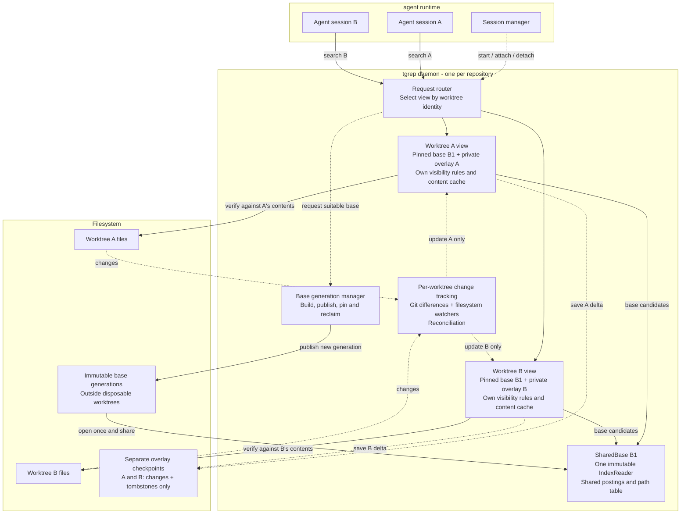
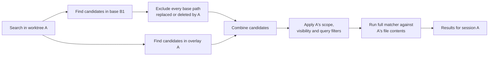
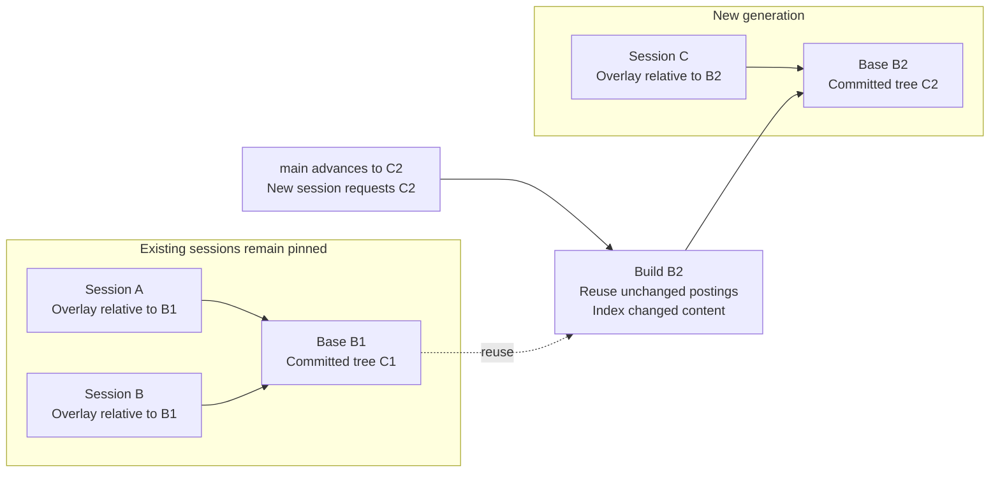

# Shared worktree index design

**Status:** end-state architecture with the shared-reader and overlay-checkpoint
foundation implemented in [PR #168](https://github.com/microsoft/tgrep/pull/168),
and [committed-tree base generations](tgrep-core/src/generations/mod.rs) implemented.
Automatic multi-worktree CLI/server support is not implemented yet.

## Goal and ownership

An agent runtime may create many worktrees from the same repository. Rebuilding
a complete trigram index for every session duplicates indexing work, disk
storage, and memory. Instead, tgrep should share immutable base data and index
only the differences belonging to each worktree.

The boundary is: **tgrep owns search correctness; the agent runtime owns
session lifecycle.** The main checkout is another worktree with its own
overlay, not a mutable source of truth for every session.

| Responsibility | Owner |
| --- | --- |
| Shared readers, base generations, overlay precedence, persistence | tgrep |
| Git-difference discovery, watchers, reconciliation, safe scan fallback | tgrep |
| Worktree-specific filtering, filename membership, and content caches | tgrep |
| Starting/supervising the daemon and configuring resource budgets | Agent runtime |
| Attaching/releasing worktrees as sessions start/stop | Agent runtime |
| Supplying the intended starting revision and known-change hints | Agent runtime, validated by tgrep |

Runtime notifications are an optimization, not the source of truth. External
editors, Git commands, and build tools can change files independently.

## Overall architecture

Run one repository-scoped daemon, identified by the canonical Git common
directory, rather than by a remote URL or branch name. Linked worktrees share
this identity; unrelated clones do not accidentally share mutable state.

The daemon shares the actual `Arc<IndexReader>`, including its loaded path
table, not just the names of the memory-mapped files. Worktrees retain
independent roots, overlays, visibility/membership state, watcher queues,
and synchronization so a checkout in one worktree need not block another's
searches.

## Base snapshots and worktree overlays

A base describes an exact committed tree under a compatible indexing profile.
Its implemented key includes repository identity, Git tree OID, indexing profile,
and index-format version; retain the commit OID for diagnostics. The profile
must account for content decoding, checkout transformations, and corpus
coverage. Dirty and untracked files from the main checkout belong in its
overlay, never in the shared base.

Every worktree pins an exact base generation. Its overlay contains the
differences between that base and the worktree's current searchable contents,
not merely differences from its current `HEAD`.

| Difference | Overlay representation |
| --- | --- |
| Added or modified file | Postings for the complete current file |
| Deleted or newly ineligible base file | Tombstone hiding its base entry |
| Renamed file | Old-path tombstone and new-path entry |
| Eligible untracked file | Worktree-only entry |
| File restored exactly to the base | Remove the override and expose the base |

Use Git diffs to discover paths, not to index patch hunks. Whole-file indexing
preserves matching across edit boundaries, context lines, and line numbers.
Discovery must include committed branch divergence, staged changes, unstaged
changes, and eligible untracked files. A commit inside a session does not make
its differences from the pinned base disappear.

## Search flow

This illustrates the existing `HybridIndex` precedence model: overlay entries
shadow base paths even when their new content does not match the query.
Candidate IDs and path resolution must use the same pinned reader snapshot,
with overlay mutations synchronized for that operation.

The base supplies candidates, not another checkout's contents. Final matching
reads the requesting worktree or its correctly versioned cache. Cache entries
must not be keyed only by relative path across worktrees. Sharing cached bytes
by content identity is a later optimization requiring verified identity.

For example, editing `auth.rs` in A hides that path's base postings only in A.
Deleting `old.rs` in A hides it with a tombstone. B still sees its own versions.
The same membership/visibility rules must apply to content searches and
`--files`, including filename-only paths without searchable postings.

## Registration, readiness, and freshness

The proposed versioned daemon API has these logical operations; names and wire
schemas are not yet a public protocol:

| Operation | Purpose |
| --- | --- |
| `attach(root, expected_head)` | Validate the worktree, select/pin a base, establish its view, and return a registration identity/readiness state |
| `search(worktree_id, ...)` / `files(worktree_id, ...)` | Route requests to the correct worktree view |
| `refresh(worktree_id, changed_paths)` | Promptly process known-change hints |
| `detach(worktree_id)` | Release the caller's registration; reclaim idle state when unused |

Normal CLI invocations should discover the same view automatically. Releasing
one session must not stop a daemon or worktree view still used by other clients.
Canonicalize and validate roots and request paths; a worktree identity is not
permission to read arbitrary paths. Protocol capability negotiation must
distinguish this service from the existing single-root server.

On attach, start capturing changes before establishing the initial delta.
Reconcile Git/filesystem state, replay queued events, and publish a consistent
base-plus-overlay view. If coverage is incomplete or change discovery fails,
scan rather than presenting a partial index as complete. A known changed path
can be verified by direct scanning while its replacement postings are built.

Keep periodic reconciliation and watcher-overflow recovery. Merely draining a
watcher queue does not prove that no filesystem notifications were missed.
An acknowledged refresh can establish that specified edits have been processed;
it is not a filesystem-wide snapshot guarantee. `--no-index` remains the escape
hatch for reading current disk contents under normal traversal rules.

Sharing removes repeated full-content indexing, not necessarily all
repository-sized startup work. Git status, untracked-file discovery, and
watcher registration may still inspect many paths. Measure these costs
separately before introducing filesystem-monitor or registration optimizations.

## When the base changes

**Never update a shared base in place.** Build and publish a new immutable
generation when a requested starting revision needs one. Deduplicate concurrent
build requests for the same compatible base.

| Event | Action |
| --- | --- |
| First session at a revision | Build a compatible base if none exists |
| Another session at the same tree/profile | Reuse the base and establish its overlay |
| Agent edits files or commits on its branch | Update only that worktree's overlay |
| New session starts from an updated `main` | Build or reuse a base for the new revision |
| `main` advances without a new session | No required work; background prewarming is optional |

Building B2 should reuse compatible unchanged postings and extract only changed
content. It can still require streaming/writing a new full index generation;
avoiding extraction does not eliminate publication I/O.

Initially, do not migrate active sessions automatically. A checkout or rebase
can be represented by recomputing that worktree's overlay against its pinned
base. An explicit base migration must instead recompute the delta against the
new base and atomically publish the new base-and-overlay pair. Swapping only
the reader would give the overlay the wrong meaning.

Retain old generations until no active worktree, in-flight query, or retained
restorable checkpoint needs them. A retention policy may evict idle checkpoints
and release their pins; restoration must then rebuild/reconcile, not silently
substitute another base. Defer removal of mapped generations on Windows.

The current core manager deliberately implements **retain-all**, not online GC:
it never deletes or rewrites a published generation, even when its last
`Arc<Generation>` pin is dropped. This also protects escaped readers/views and
restorable checkpoints across process restarts. There is no deletion API or
automatic active-session migration. Reclaiming storage offline requires stopping
all users and discarding dependent checkpoints. A later daemon can introduce
ownership-aware retention and resource budgets; absence of a live in-process pin
alone is not proof that a generation is deletable.

## Persistence and compatibility

Store bases outside disposable worktree directories. Persist each worktree's
delta separately, bound to its exact base and identity. Checkpointing a session
must not materialize another complete index or merge its changes into the base.

| Concern | Required behavior |
| --- | --- |
| Ignore rules and corpus coverage | Use worktree-specific membership. A shared tracked-path superset can avoid irreversible omissions; newly admitted files absent from the base still need discovery/indexing |
| Hidden files and `--files` | Maintain worktree visibility and filename-only membership, not just content postings |
| CRLF, encoding, LFS, smudge filters | Git blobs are not necessarily checkout bytes; reuse postings only with compatible content semantics, otherwise index affected files or scan |
| Sparse checkout, symlinks, submodules, case behavior | Respect materialized paths and existing traversal semantics, not just the committed tree |
| Incompatible query options or partial coverage | Fall back to the existing scan behavior rather than omit eligible files |
| Missing daemon/checkpoint/base | Use a validated reconciled view or scan; never silently answer from the base alone |
| Restart or interrupted publication | Validate the generation/checkpoint pairing and re-establish freshness before enabling indexed queries |

The current checkpoint implementation guarantees atomic replacement visibility,
including overwriting an existing checkpoint on Windows. It syncs file contents
before replacement but does not sync the parent directory afterwards; this is
**not a power-loss durability guarantee**. Stale or missing checkpoints must be
reconciled or rebuilt.

Existing CLI behavior, RPC protocol, index format, and single-root serving must
remain available while shared mode is introduced explicitly. Do not implement
sharing by pointing today's servers at the same `--index-path`: their
publication path still writes a complete index.

## Implemented generation API

`tgrep_core::generations::Repository::discover(root)` invokes Git without a shell
and identifies the canonical native common directory. `.git` files, linked
worktrees, subdirectories and bare repositories are supported. Independent
clones do not share identity, even with equal tree OIDs and remotes.
`Repository::git_dir()` retains the discovered worktree's metadata directory so
symbolic revisions such as `HEAD` resolve there, not at another worktree's HEAD.
Ambient `GIT_*` environment overrides and replace refs are ignored; Git failures,
missing objects and unsupported native/index paths are explicit errors.

`GenerationManager::new(repository)` uses
`<common-dir>/tgrep-bases-v1/<repository-identity>/`.
`with_storage(repository, storage)` accepts an existing trusted external
directory and uses a repository-identity subdirectory. It rejects storage in
registered worktrees, Git metadata or another index snapshot. Stores and their
ancestors must not be externally renamed or modified while in use.
Checks cover the effective canonical repository-identity directory as well as
the supplied parent, including an existing worktree or snapshot at that child.

| API | Contract |
| --- | --- |
| `ensure(revision, profile, predecessor)` | Resolve an exact commit/tree, build or reuse the key; incompatible supplied predecessors error |
| `EnsureResult` | Pinned `Arc<Generation>`, requested commit, and per-request `BuildStats` |
| `open(key)` / `list()` | Open exact or list validated published generations; errors never become empty bases |
| `Generation::key()` / `commit_oid()` | Serializable exact repository/tree/profile/format/schema key; first publishing commit for diagnostics |
| `Generation::base()` | The shared `Arc<SharedBase>`; use existing worktree/overlay APIs without changing their validation |
| `entries()` / `entry(path)` | Sorted complete tracked membership, Git modes/OIDs/raw sizes and content classification |
| `TrackedEntry::matches_worktree_bytes(bytes)` | Decoded-content identity comparison only, not a freshness/visibility/eligibility claim |
| `retention()` | `RetentionPolicy::RetainAll`, including after all current pins drop |

The versioned profile is `RawGitBlobAutoV1` plus `TrackedRegularFilesV1` and a raw
blob-size cap (64 MiB by default; `None` disables it). It invokes the existing
automatic decoder, binary classifier and masked trigram extractor on raw blobs,
never checkout-filtered bytes. Ignore rules, hidden visibility and binary
extensions are deliberately not applied to this tracked-path superset.
Destination mode/size eligibility is always recomputed. Only regular-file
predecessor entries with compatible indexed content supply reusable postings.
Binary entries may reuse their classification, but cannot supply absent postings.
Empty and short text entries carry a content identity even with zero postings.
Oversized, binary, symlink and gitlink records remain distinguishable in tracked
membership; symlinks and gitlinks are not followed or content-indexed.

Clean Git status and equal blob IDs do not prove equivalence of worktree bytes.
Layer 2 must prove compatible decoded identities from stable reads, or overlay
transformed/changed files or scan. It must also apply worktree-specific membership,
including ignored/extension-filtered files, sparse checkout and filesystem case
behavior. Non-UTF-8 tracked names, unsafe relative paths, and paths unrepresentable
on the current platform are explicit unsupported errors, not lossy aliases.
Native repository paths are retained losslessly. Content/coverage enum versions
must advance if their semantics change, independently of the index format.

A supplied compatible predecessor provides postings by blob identity, including
renames/copies, without reading unchanged blob contents. Changed/new blobs use
one `git cat-file --batch` process and the existing spill sorter, then publish a
complete streamed index. Memory includes one blob, its decoded text/masks,
O(tracked paths) metadata and the bounded sorter arena, not all postings.
Without a predecessor the first build extracts the full committed corpus.
`BuildStats` counts actual blob reads/bytes, extraction calls, reused indexed
files, copied postings, and whether this request published or reused a generation.
`predecessor_posting_lists_read` counts decoded predecessor lists; when no indexed
paths reuse postings, generation creation does not traverse the predecessor.
Empty/short indexed files retain their paths and content identities without
triggering that traversal. Strict snapshot opening records per-file posting
presence during its existing validation pass, including for older generations;
there is no new metadata field, format boundary, or additional posting scan.
Publication I/O and metadata enumeration are not eliminated by extraction reuse.

One OS file lock per repository store serializes cooperating processes, including
different-tree builds; it is released on process exit/crash. A weak in-process
cache shares live `Arc<Generation>` pins and their shared reader/path table.
Cold validation/fingerprinting runs outside the process-wide cache mutex, so it
does not block unrelated repository cache hits; insertion rechecks for a winner.
Staging uses unique `.stage-*` directories on the same filesystem. The complete
index is strictly opened, its fingerprint and checksummed tracked metadata
validated, and files synced before atomic directory rename to the key's name.
Final directories are never overwritten, even if corrupt. Abandoned staging
directories are ignored, not advertised or automatically garbage-collected.
Atomic visibility is not a parent-directory power-loss durability guarantee.
These checks detect inconsistent/corrupt data; storage must still be trusted,
not treated as an authenticated format for adversarially rewritten files.

For layer 2, retain the generation pin with each view and serialize its key
alongside overlay checkpoints. The generation's `SharedBase` fingerprint still
binds the checkpoint to exact index bytes. Reopening that key is not readiness:
reconcile the worktree before enabling indexed queries. No watcher, Git delta
discovery, daemon wire schema or CLI shared-mode behavior is introduced here.

## Implementation status and rollout

The implemented increments are core-library APIs, not automatic shared indexing:

| Surface | Current status |
| --- | --- |
| [`SharedBase`](tgrep-core/src/shared.rs) | Opens a validated reader once; creates independent worktree-rooted views sharing its `Arc` |
| [`HybridIndex`](tgrep-core/src/hybrid.rs) / [`LiveIndex`](tgrep-core/src/live.rs) | Reuses existing candidate merging, replacements, and tombstones |
| Overlay checkpoints | Atomic delta-only save/restore; validate format, root, paths, and exact base fingerprint |
| Base identity | Index fingerprint plus repository/tree/profile/format/schema generation key |
| Base immutability | Generation manager stages/validates/publishes once; external callers must not mutate mapped files |
| [`Regression coverage`](tgrep-core/tests/shared_worktrees.rs) | Sharing/isolation, masks, tombstones, restoration, compatibility, repeated saves, and Windows failure recovery |
| [`Generation management`](tgrep-core/src/generations/mod.rs) | Canonical common-dir identity, raw committed-tree builds, incremental posting reuse, cross-process deduplication, pins and retain-all |
| [`Generation coverage`](tgrep-core/tests/generations.rs) | Temporary repositories/worktrees, thread/process races, content transformations, immutable old readers, errors and interrupted publication |
| Worktree synchronization and daemon routing | Follow-up work; not yet implemented |

Shared-base validation rejects mismatched empty lookup/posting sections and
metadata counts inconsistent with the opened sections, while allowing empty
indexes and short files. Shared snapshots require aligned, contiguous posting
ranges covering the entire postings section, valid trigrams, strictly
increasing valid file IDs in each posting list, and nonzero location masks.
Checkpoint destinations reject trailing separators and
current-directory suffixes, and exclude the base and its
descendants by directory identity, even if the base has been renamed. Unix
staging, replacement, and cleanup are relative to an open parent-directory
handle; Windows holds non-delete-sharing handles on the canonical parent and
all its ancestors until publication completes. A renamed/replaced pathname
cannot redirect publication into the base. Root identities preserve the existing
JSON string encoding for Unicode paths and use tagged platform-native units for
non-Unicode Unix/Windows paths; older readers reject the latter representation.

Merge the foundation independently once its normal review and checks are
satisfied; do not expand it into the entire feature. Keep follow-up work in
reviewable increments, each with its own correctness coverage:

1. **Base generations (implemented):** Git tree/profile identity, immutable
   build/publication, incremental reuse, pins and conservative retain-all.
2. **Worktree synchronization:** complete delta discovery, private membership,
   watchers/reconciliation, checkpoint recovery, and readiness gating.
3. **Daemon and integration:** worktree registration/routing, CLI discovery,
   versioned agent runtime integration, resource budgets, and scan fallback.

Before enabling automatic shared mode, verify isolated results against scans
for divergent branches, edits/deletes/renames, ignore changes, checkout
transformations, sparse worktrees, watcher loss, and restarts. Exercise existing
single-root clients and formats on supported platforms. Measure content
extraction, startup work, memory, and publication I/O separately.

Keep the first implementation two-layered: one shared base plus one private
overlay per worktree. Content-addressed caches, shared branch intermediates, and
automatic base migration can follow only if measured workloads justify them.
